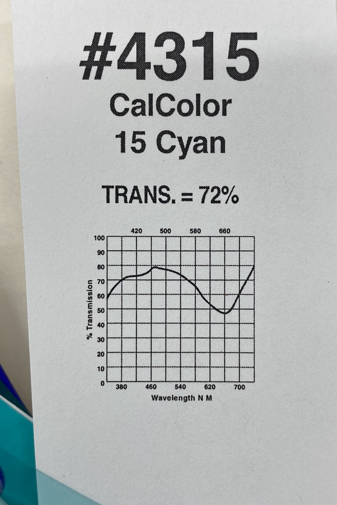
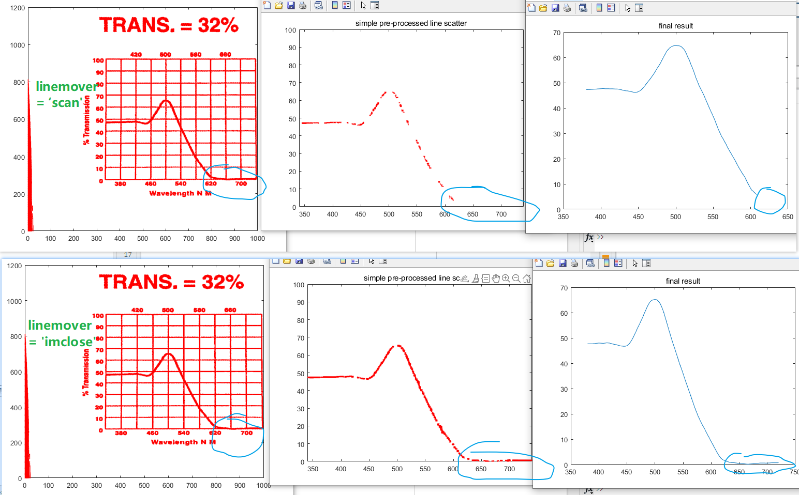

# image_graph_line_to_digital_convert

## results

## note

the digital form of the points and the preview line graph (like above) will be stored automatically.

## usage

set a few parameters in the head of `imgPlot2digital.m`, also some de_noise related in function `de_noiser()`.

what the program does is

1. convert the image to gray, then binary.
2. read the "black" pixels and convert them from the image coordinate system to the "coordinate"(the axis in the image) coordinate system.
3. flip the coordinate system, bc matlab use `-y` in image coordinate system.
4. drop some points (like remove the grid lines in axis, see in function `reduceLines`, `reduce_xy` and `de_noiser`).
5. make x-y pairs unique.	***now we have a perfect line plot~***
6. do an interpret from the points we have above to obtain the points at x-axis u set.
7. smooth filter the points above using `mean filter`.
8. ***DONE!***

simply run `run_allimgs.m` and wait for the magic appears.

If u find this repo helps, a star will be the best support.
