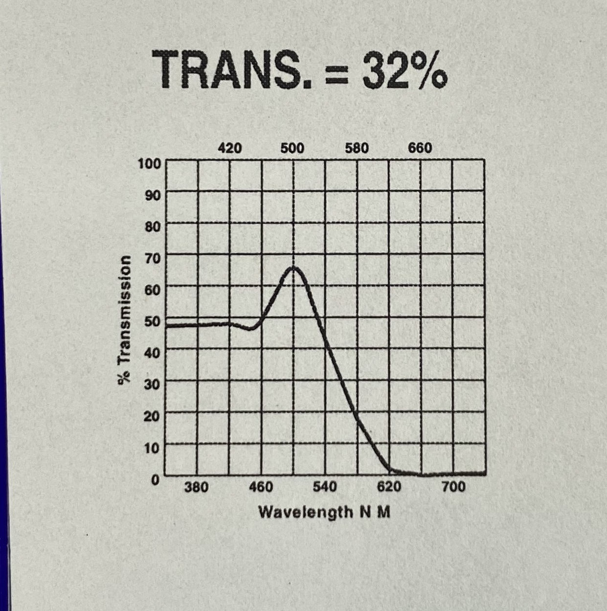

# image_graph_line_to_digital_convert

## results

## note

the digital form of the points and the preview line graph (like above) will be stored automatically.

## usage

set a few parameters `args` in `run_allimgs.m`, also some de_noise related in the head of `imgPlot2digital.m`.

### linemover mode

There're two modes of removing the grid lines. By setting the formal parameter `linemover` of the function `imgPlot2digital()`, results are shown in above.

* The `scan` mode is done by setting the `step_x` and `step_y` vars, so when the grid line is covered by the plot line, it'll remove the plot line while removing the grid line.
* The `imclose` mode is a digital image processing skill, when the plot line is bolder than the grid line, after binarizing the image, the black pixel size in the gird line is smaller than its in the plot line, so by setting the structuring element size we can remove the small black pixels, aka the grid line.
* Empty char [] stands DO NOT apply grid lines removing algorithm.

### what the program does

1. convert the image to gray, then binary.
2. read the "black" pixels and convert them from the image coordinate system to the "coordinate"(the axis in the image) coordinate system.
3. flip the coordinate system, bc matlab use `-y` in image coordinate system.
4. drop some points (like remove the grid lines in axis, see in function `reduceLines`, `reduce_xy` and `de_noiser`).
5. make x-y pairs unique.	***now we have a perfect line plot~***
6. do an interpret from the points we have above to obtain the points at x-axis u set.
7. find the first derivative of the points above and get rid of the values bigger than a threshold (set the formal parameter of function `final_plot_filter()`)
8. smooth filter the points above using `mean filter`.
9. ***DONE!***

### run

simply run `run_allimgs.m` and wait for the magic happens.

If u find this repo helps, a star will be the best support.
